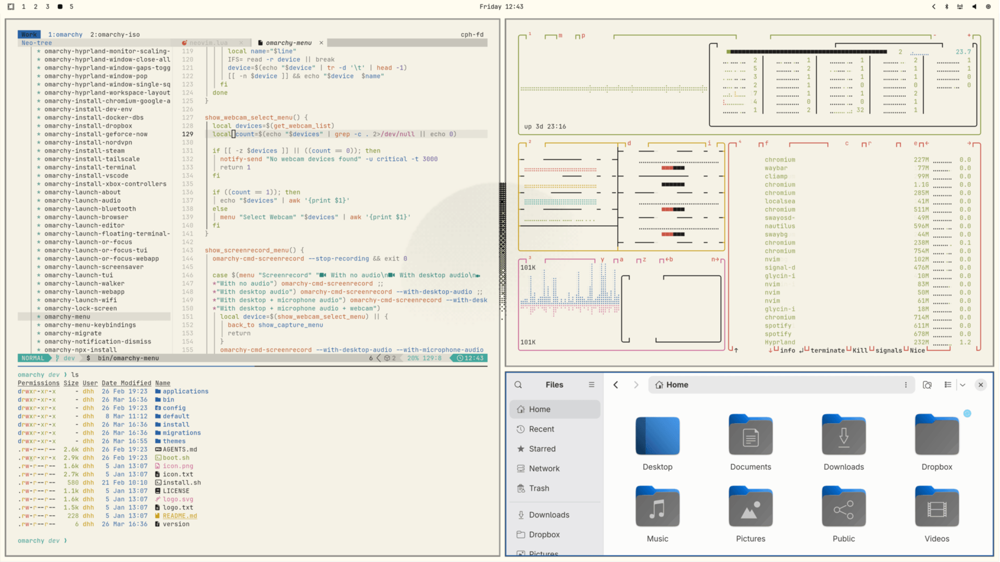

# Omarchy Mooni

Mooni is a light Omarchy v4 theme built around honey yellow, ivory surfaces,
and deep cocoa text. Mooni Dark will be its night-time companion.

[Versão em português](README.md)

## Install

~~~bash
omarchy theme install https://github.com/PedroAugustoOK/omarchy-mooni-theme
omarchy theme set mooni
~~~

Cycle its wallpapers with:

~~~bash
omarchy theme bg next
~~~

## Included

- `colors.toml` palette for the Omarchy-generated terminal, editor, browser,
  shell, and desktop integrations.
- Complete `shell.toml` coverage for the bar, menus, notifications, polkit,
  lock screen, and wallpaper picker.
- Yaru Yellow icons and a btop theme.
- Four 3840×2160 wallpapers plus illustrative desktop and unlock previews.
- Optional, palette-generated integrations for bat, Cava, git-delta,
  Fastfetch, fzf/Fish, Lazygit, Steam, Superfile, Vencord, Yazi, and Zed.

## Optional integrations

The Mooni core is intentionally small. Extra application configs live in
`integrations/`; they are never copied automatically, so each user keeps
control of their local settings. See [INTEGRATIONS.md](INTEGRATIONS.md) for
setup instructions.

Regenerate those files after changing the palette:

~~~bash
python3 scripts/generate-integrations.py
~~~

## Wallpapers

| File | Scene |
| --- | --- |
| `01-mooni-feast.png` | Yellow-toned dinner scene |
| `02-mooni-pumpkin.png` | Pumpkin landscape |
| `03-mooni-garden.png` | Sunlit open garden |
| `04-omarchy-wordmark.png` | Official wordmark on a warm yellow gradient |

See [ATTRIBUTIONS.md](ATTRIBUTIONS.md) for asset notes.

## Development

~~~bash
python3 scripts/generate-integrations.py
python3 scripts/validate-theme.py
~~~

The validator checks the palette, contrast, shell coverage, previews,
wallpapers, and synchronization of generated integrations.

## License

[MIT](LICENSE).
