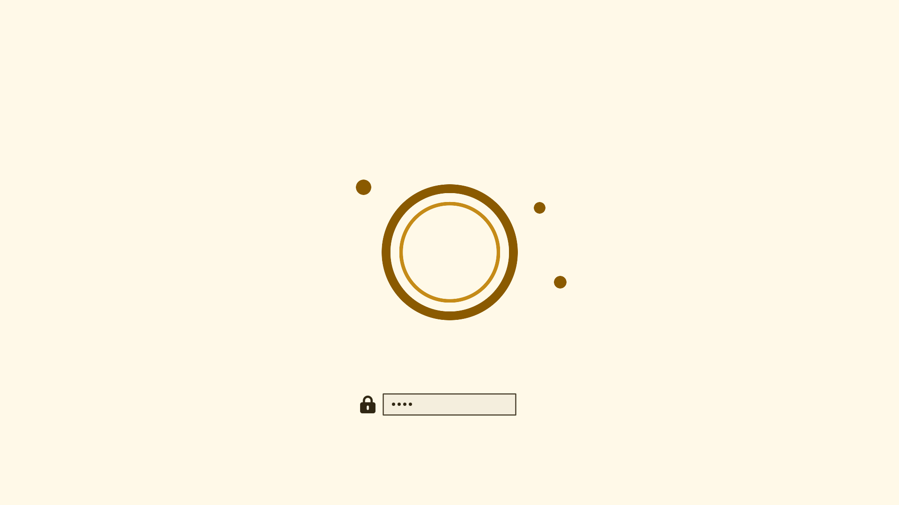

# Omarchy Mooni

Tema claro para Omarchy v4, construído com amarelo-mel, superfícies de marfim
e texto em cacau profundo. A versão escura, Mooni Dark, será sua variante
noturna.

[English version](README.en.md)

## Instalação

~~~bash
omarchy theme install https://github.com/PedroAugustoOK/omarchy-mooni-theme
omarchy theme set mooni
~~~

Para trocar o wallpaper:

~~~bash
omarchy theme bg next
~~~

## Inclui

- Paleta em `colors.toml` para Omarchy, terminal, editores e aplicativos
  suportados pelo sistema.
- `shell.toml` para barra, menus, notificações, polkit, lockscreen e seletor
  de wallpapers.
- Ícones Yaru Yellow.
- Tema do btop.
- Quatro wallpapers em 3840×2160.
- Captura real do desktop e prévia fiel do desbloqueio de disco Plymouth.
- Integrações opcionais para bat, Cava, git-delta, Fastfetch, fzf, Lazygit,
  Steam, Superfile, Vencord, Yazi e Zed.

As integrações adicionais e suas instruções estão em
[INTEGRATIONS.md](INTEGRATIONS.md). O núcleo do tema fica na raiz; os extras
ficam isolados em `integrations/` e são gerados a partir de `colors.toml`.

## Desbloqueio de disco

`preview-unlock.png` é renderizado com o símbolo `unlock.png`, as cores do tema
e a geometria oficial do Plymouth usada pelo Omarchy.

## Wallpapers

| Arquivo | Cena |
| --- | --- |
| `01-mooni-feast.png` | Jantar em tons de amarelo | 
| `02-mooni-pumpkin.png` | Paisagem com abóboras | 
| `03-mooni-garden.png` | Jardim aberto e ensolarado | 
| `04-omarchy-wordmark.png` | Wordmark oficial grande em fundo marfim sólido |

As notas sobre os assets estão em [ATTRIBUTIONS.md](ATTRIBUTIONS.md).

## Desenvolvimento

~~~bash
python3 scripts/generate-integrations.py
python3 scripts/validate-theme.py
~~~

O teste verifica a paleta, contraste, shell, previews, wallpapers e se as
integrações geradas estão sincronizadas com a paleta.

## Licença

[MIT](LICENSE).

## Arquivos gerados e validação

A identidade do tema vem de `theme.toml`, independentemente do nome da pasta
do clone. `colors.toml` define a paleta; `code-colors.toml` define seus papéis.

`vscode-theme.json` e `helix.toml` na raiz são arquivos somente de cores,
aplicados pela rota padrão do Omarchy. Os equivalentes em `integrations/`
servem para uso independente; Zed continua opcional. Neovim e terminais seguem
os templates do sistema: a cobertura de sintaxe depende também da linguagem,
do parser e do servidor de linguagem, não apenas da paleta.

~~~bash
python3 scripts/generate-code-theme.py
python3 scripts/generate-code-theme.py --check
sh scripts/render-assets.sh
python3 scripts/validate-theme.py
~~~

Os testes conferem saídas desatualizadas, semântica dos editores, contraste de
texto e seleção, além dos arquivos do tema. Não substituem inspeção visual dos
aplicativos abertos. Esta revisão não instala hooks nem recarrega o VS Code.

Veja [REVIEW.md](REVIEW.md) para a comparação com o Omarchy oficial e limites.
